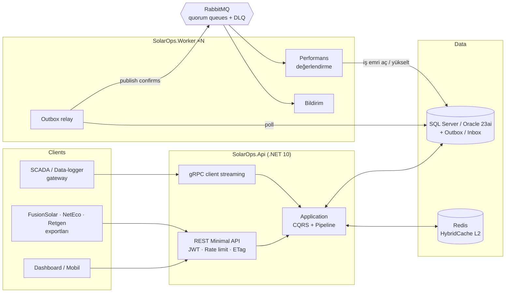
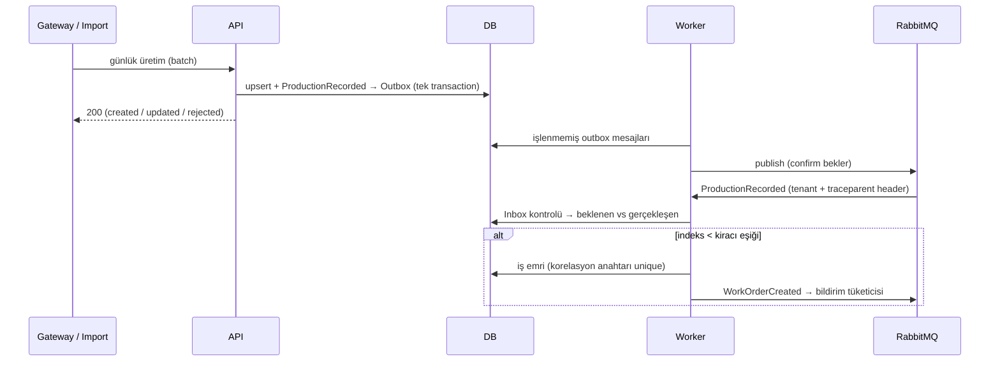

# SolarOps Platform

[](https://github.com/Kayne-C/solarops-platform/actions/workflows/ci.yml)


**Çok kiracılı (multi-tenant) güneş santrali varlık performansı ve O&M platformu.**
Farklı inverter üreticilerinden (Huawei FusionSolar, NetEco, Retgen) ve SCADA ağ geçitlerinden gelen günlük üretimi tek
bir yerde toplar, PVsyst beklentisiyle modül bozunumunu (degradation) hesaba katarak karşılaştırır ve düşük performansı
**otomatik, tekrarsız ve önceliklendirilmiş iş emrine** dönüştürür.

> Bu repo, Node.js/Express + React ile yazdığım santral yönetim prototipinin (v1) **.NET 10 ile baştan tasarlanmış**
> halidir. v1'in gerçek sorunları ve v2'deki çözümleri için [v1 → v2](#v1--v2-neler-değişti) bölümüne bakın.

---

## İçindekiler

- [Öne çıkanlar](#öne-çıkanlar)
- [Mimari](#mimari)
- [Hızlı başlangıç](#hızlı-başlangıç)
- [API turu](#api-turu)
- [Testler](#testler)
- [Ölçümler](#ölçümler)
- [v1 → v2: neler değişti?](#v1--v2-neler-değişti)
- [Proje yapısı](#proje-yapısı)
- [Yol haritası](#yol-haritası)

## Öne çıkanlar

| Alan | Uygulama |
|---|---|
| **Multi-tenancy** | JWT `tenant_id` claim → scoped `TenantContext` → **EF Core 10 named query filter** (okuma) + `SaveChanges` interceptor (yazma). Çözümlenmemiş kiracı = sıfır satır (*fail-closed*). Başka kiracının kaydı 404 döner, varlığı bile sızmaz. |
| **Clean Architecture + CQRS** | Domain → Application → Infrastructure → Api/Worker. Bağımlılık kuralı **mimari testlerle** CI'da zorlanır. Lisans riski taşımayan, ~60 satırlık kendi mediator'ımız + pipeline behavior'lar (validation, telemetry). |
| **Event-driven** | **Transactional Outbox** → RabbitMQ 4 (topic exchange, **quorum queue**, delivery-limit + **DLQ**) → **Inbox** ile idempotent tüketiciler. Aynı ay için tek iş emri: kiracı-benzersiz korelasyon anahtarı + unique index. |
| **Yüksek eşzamanlılık** | İş emirlerinde portable optimistic concurrency (Oracle'da da çalışır) → HTTP **ETag / If-Match** (412, 428). Toplu upsert: batch başına 1 aralık okuma + 1 `SaveChanges`. |
| **Yüksek hacimli ingest** | REST bulk upsert, dosya import'u (FusionSolar/Retgen `.xlsx`, NetEco UTF-16 `.csv`) ve **gRPC client streaming** — hepsi tek yazma yolundan (`DailyYieldWriter`) geçer. |
| **Domain doğruluğu** | PVsyst projeksiyonu `E(t) = E(base) · (1 − r)^(t − base)`; kısmi ay için pro-rata beklenti; fiziksel üst sınır (kurulu güç × 24 saat) ile kümülatif sayaç değerinin günlük üretim sanılmasını engelleme. |
| **Önbellek** | **HybridCache** (L1 in-process + L2 Redis), stampede koruması, kiracı kapsamlı anahtarlar ve **tag tabanlı invalidation**. |
| **Veritabanı taşınabilirliği** | **SQL Server ve Oracle 23ai** için ayrı migration setleri; geliştirme/test için sıfır bağımlılıklı SQLite. Oracle'a özel `DateOnly → DATE`, LOB boyutlandırma. |
| **Güvenlik** | PBKDF2 parola hash'i, kullanıcının var olup olmadığını yanıt süresinden belli etmeyen login, rol politikaları, **kiracı başına token-bucket rate limiting** (noisy neighbour), giriş denemesi sınırlaması, RFC 9457 ProblemDetails (iç hata detayı sızdırmaz). |
| **Gözlemlenebilirlik** | OpenTelemetry trace/metric/log → **Aspire Dashboard**. Trace context outbox üzerinden taşınır: API isteği → RabbitMQ → Worker tek trace'te görünür. |
| **Çalıştırma** | Chiseled (distroless, non-root) container'lar, tek seferlik `migrator`, 2 replikalı worker, GitHub Actions CI. |

## Mimari



Düşük performansın iş emrine dönüşmesi:



Ayrıntılar: [docs/architecture.md](docs/architecture.md) · Kararlar: [docs/adr](docs/adr)

## Hızlı başlangıç

**Gereksinimler:** .NET 10 SDK. (Tam topoloji için Docker.)

### 1) Sıfır bağımlılık — SQLite + in-process mesajlaşma

```bash
dotnet run --project src/SolarOps.Api
# Scalar UI:  http://localhost:5080/scalar/v1
# OpenAPI:    http://localhost:5080/openapi/v1.json
```

İlk açılışta iki izole demo kiracı oluşturulur. Karapınar GES-2 son 12 günde inverter arızası simüle eder; outbox
işlendiği anda bu santral için **Urgent** iş emri otomatik açılır.

| Kiracı | E-posta | Rol | Parola |
|---|---|---|---|
| `anatolia-solar` | `admin@anatolia-solar.demo` | TenantAdmin | `SolarOps!2026` |
| `anatolia-solar` | `engineer@anatolia-solar.demo` | Engineer | `SolarOps!2026` |
| `anatolia-solar` | `tech@anatolia-solar.demo` | Technician | `SolarOps!2026` |
| `aegean-energy` | `admin@aegean-energy.demo` | TenantAdmin | `SolarOps!2026` |

### 2) Tam dağıtık topoloji — SQL Server + RabbitMQ + Redis + 2 Worker + Aspire Dashboard

```bash
docker compose up --build
# API:              http://localhost:8080/scalar/v1   (gRPC: localhost:8081)
# Aspire Dashboard: http://localhost:18888            (trace / metric / log)
# RabbitMQ UI:      http://localhost:15672            (solarops / solarops)
```

### 3) Aynı stack, Oracle Database 23ai Free üzerinde

```bash
docker compose -f docker-compose.yml -f docker-compose.oracle.yml up --build
```

## API turu

```bash
TOKEN=$(curl -s -X POST localhost:5080/api/v1/auth/token -H 'content-type: application/json' \
  -d '{"tenant":"anatolia-solar","email":"engineer@anatolia-solar.demo","password":"SolarOps!2026"}' | jq -r .accessToken)

# Portföy: tüm santrallerin bu ayki beklenen vs gerçekleşen üretimi (önbellekli)
curl -s "localhost:5080/api/v1/portfolio/performance?year=2026&month=10" -H "Authorization: Bearer $TOKEN" | jq

# Pipeline'ın açtığı iş emirleri
curl -s "localhost:5080/api/v1/work-orders?priority=Urgent" -H "Authorization: Bearer $TOKEN" | jq

# Optimistic concurrency: ETag al → If-Match ile değiştir (eski ETag → 412, ETag yok → 428)
curl -si "localhost:5080/api/v1/work-orders/{id}" -H "Authorization: Bearer $TOKEN" | grep -i etag
curl -s -X POST "localhost:5080/api/v1/work-orders/{id}/activities" -H "Authorization: Bearer $TOKEN" \
  -H 'If-Match: "<etag>"' -H 'content-type: application/json' -d '{"description":"Sahaya çıkıldı"}'

# Inverter exportu içe aktarma (FusionSolar | NetEco | Retgen)
curl -s -X POST "localhost:5080/api/v1/plants/{plantId}/daily-yields/imports" -H "Authorization: Bearer $TOKEN" \
  -F file=@fusionsolar.xlsx -F format=FusionSolar | jq
```

| Uç nokta | Açıklama |
|---|---|
| `POST /api/v1/auth/token` | Kiracı + e-posta + parola → JWT (IP başına dakikalık sınır) |
| `GET/POST /api/v1/plants` | Santral listesi (sayfalı, filtreli) / kayıt |
| `PUT /api/v1/plants/{id}/daily-yields` | İdempotent toplu upsert (≤ 5.000 gün) |
| `POST /api/v1/plants/{id}/daily-yields/imports` | Dosya import'u, satır bazlı uyarılarla |
| `PUT /api/v1/plants/{id}/baselines/{year}` | 12 aylık PVsyst beklentisi |
| `POST /api/v1/plants/{id}/baselines/projections` | Bozunum projeksiyonu (isteğe bağlı kalıcı) |
| `GET /api/v1/plants/{id}/performance?year=` | Aylık performans indeksi |
| `GET /api/v1/portfolio/performance?year=&month=` | Kiracı geneli dashboard |
| `GET/POST /api/v1/work-orders` · `…/{id}/assignments` · `…/transitions` · `…/activities` | İş emri yaşam döngüsü (ETag zorunlu) |
| `YieldIngestion.StreamDailyYields` (gRPC) | Gateway'ler için client-streaming ingest |
| `GET /health/live` · `GET /health/ready` | Liveness / readiness (DB, RabbitMQ, Redis) |

## Testler

```bash
dotnet test --solution SolarOps.slnx
```

**78 test** — her CI koşusunda:

| Proje | Kapsam |
|---|---|
| `Domain.UnitTests` (32) | Bozunum projeksiyonu, performans sınıflandırması, iş emri durum makinesi, fiziksel sınır kuralları |
| `Application.UnitTests` (3) | Mediator pipeline sırası, validation short-circuit, handler keşfi |
| `Infrastructure.Tests` (16) | Üç vendor formatı (Türkçe başlıklar, UTF-16, tırnak içi tab, DST kaynaklı hatalı satır), sayı formatları |
| `ArchitectureTests` (8) | Katman bağımlılık kuralı, public setter yasağı, handler'lar `internal sealed`, her request'e tek handler |
| `Api.IntegrationTests` (19) | `WebApplicationFactory` ile gerçek pipeline: kiracı izolasyonu, 412/428, outbox → olay → tekil iş emri, dosya import'u, cache invalidation, gRPC stream (500'lük batch'ler), yetkilendirme |

Ayrıca CI, EF Core modeli ile **SQL Server ve Oracle migration'larının senkron** olduğunu doğrular ve container imajlarını derler.

## Ölçümler

k6 ile, 4 vCPU / 16 GB tek VM üzerinde (API, 2 worker, veritabanı, RabbitMQ ve Redis **aynı makinede Docker'da**) ölçüldü.
Ayrıntı ve tekrar üretme adımları: [docs/benchmarks.md](docs/benchmarks.md).

| Senaryo | SQL Server 2022 | Oracle 23ai Free¹ |
|---|---|---|
| Portföy dashboard, 500 istek/sn sabit yük | **p95 2,1 ms**, %0 hata | p95 2,5 ms, %0 hata |
| Toplu upsert, 6 eşzamanlı yazıcı × 365 satır | **~13.000 satır/sn** (p95 380 ms/batch) | ~4.100 satır/sn |
| Dashboard okuma + yoğun yazma aynı anda | p95 82 ms @ 500 istek/sn, 11.000 satır/sn yazarken | — |
| Outbox → işlendi gecikmesi (2.198 olay, burst) | ort. 0,6 sn, maks. 5,2 sn | — |
| Önbellek ıskası → isabeti (tek istek) | 12,7 ms → 2,4 ms | — |

¹ Oracle Free sürümü 2 CPU iş parçacığı ve 2 GB RAM ile sınırlıdır.

## v1 → v2: neler değişti?

| v1 prototip (Node.js/Express + React) | v2 (.NET 10) |
|---|---|
| Excel/CSV tarayıcıda parse ediliyordu; FusionSolar ve Retgen'de tarih **2025-06 olarak sabit kodluydu** | Sunucu tarafı strategy parser'ları; kolonlar başlıktan bulunur (TR/EN), tarih her satırdan okunur, hatalı satırlar uyarıyla atlanır |
| Toplu kayıtta **satır başına 2 sorgu** (`findOne` + `update/create`) | Batch başına 1 aralık okuma + 1 `SaveChanges`; plant başına tek olay |
| Tek şirket, kiracı kavramı yok | Kiracı izolasyonu: okuma filtresi + yazma interceptor'ı + kiracı kapsamlı cache/rate limit |
| İş emirlerinde son yazan kazanır | ETag / If-Match ile optimistic concurrency |
| Performans karşılaştırması ve bozunum hesabı arayüzde, elle | Domain servisi + olay güdümlü değerlendirme → otomatik iş emri |
| Yalnızca PostgreSQL (Sequelize) | SQL Server + Oracle (ayrı migration'lar), SQLite ile yerel geliştirme |
| Hata cevaplarında `err.message` dışarı veriliyordu | RFC 9457 ProblemDetails, trace id ile, iç detay sızmaz |
| Fiilen otomatik test yok | 78 otomatik test + mimari kurallar CI'da |
| `console.log` | OpenTelemetry + Aspire Dashboard, uçtan uca trace |

## Proje yapısı

```text
src/
  SolarOps.Domain/                  Aggregate'ler, value object'ler, domain servisleri ve olaylar (bağımlılıksız)
  SolarOps.Application/             CQRS use case'leri, validator'lar, pipeline behavior'lar, olay handler'ları
  SolarOps.Infrastructure/          EF Core 10, multi-tenancy, outbox/inbox, RabbitMQ, HybridCache, parser'lar
  SolarOps.Migrations.SqlServer/    SQL Server migration'ları
  SolarOps.Migrations.Oracle/       Oracle migration'ları
  SolarOps.Api/                     Minimal API + gRPC, JWT, rate limiting, ProblemDetails, OpenAPI/Scalar
  SolarOps.Worker/                  Outbox relay + RabbitMQ tüketicileri
tests/
  SolarOps.*.Tests / IntegrationTests / ArchitectureTests
  load/                             k6 yük testleri
docs/                               Mimari, ADR'ler, ölçümler
```

## Yol haritası

- [ ] OSOS / EPİAŞ entegrasyonu ile sayaç ve piyasa verisinin otomatik çekilmesi
- [ ] Işınım (irradiance) verisiyle gerçek Performance Ratio (PR) hesabı
- [ ] Blazor/React yönetim paneli ve mobil saha uygulaması (offline-first iş emirleri)
- [ ] Testcontainers ile CI'da SQL Server + Oracle + RabbitMQ entegrasyon matrisi
- [ ] Büyük kiracılar için database-per-tenant seçeneği
- [ ] Helm chart + KEDA ile kuyruk derinliğine göre worker ölçekleme
